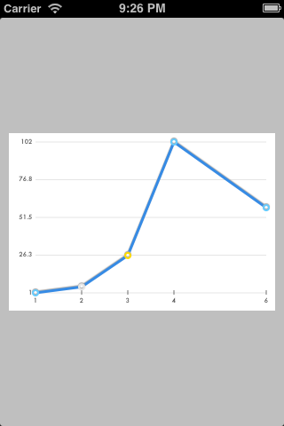
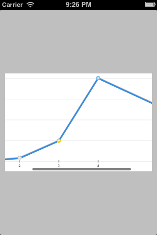

# FDGraphView

`FDGraphView` is an UIView subclass I created for my next app. It was built using the CoreGraphics’ APIs.

## Usage

### FDGraphView

Add `FDGraphView.{h,m}` to your project, import the header where you want to use this little bastard and here you go:

    FDGraphView *graphView = [[FDGraphView alloc] initWithFrame:CGRectMake(10, 130, 300, 200)];

    NSMutableArray *myDataPoints = [[NSMutableArray alloc] init];
    
    FDDataPoint *dp = [[FDDataPoint alloc] initWithX:1 Y:1];
    [myDataPoints addObject:dp];
    dp = [[FDDataPoint alloc] initWithX:2 Y:2 type:FDDataPointTypeMinor];
    [myDataPoints addObject:dp];
    dp = [[FDDataPoint alloc] initWithX:4 Y:3];
    [myDataPoints addObject:dp];
    dp = [[FDDataPoint alloc] initWithX:5 Y:15];
    [myDataPoints addObject:dp];
    graphView.dataPoints = [[NSArray alloc] initWithArray:myDataPoints];
    
    [self.view addSubview:graphView];

A few style-related options are available, look in the header file.

If you are scared of messing around you should spend your time differently.

### FDGraphScrollView

This is a subclass of `UIScrollView` that serves as a wrapper around `FDGraphView`.

Add `FDGraphScrollView.{h,m}` to your project, import the header where you want to use the component:

    FDGraphScrollView *scrollView = [[FDGraphScrollView alloc] initWithFrame:CGRectMake(10, 130, 300, 200)];
    
    // data
    NSMutableArray *myDataPoints = [[NSMutableArray alloc] init];
   
    FDDataPoint *dp = [[FDDataPoint alloc] initWithX:1 Y:1];
    [myDataPoints addObject:dp];
    dp = [[FDDataPoint alloc] initWithX:2 Y:2 type:FDDataPointTypeMajor];
    [myDataPoints addObject:dp];
    dp = [[FDDataPoint alloc] initWithX:4 Y:3];
    [myDataPoints addObject:dp];
    dp = [[FDDataPoint alloc] initWithX:5 Y:15];
    [myDataPoints addObject:dp];
    scrollView.dataPoints = [[NSArray alloc] initWithArray:myDataPoints];

    [self.view addSubview:scrollView];

This is the result:

## TODO

The main reason for releasing this, besides my awesomeness, is getting your help.

So help me check all these little boxes:

- [ ] Add more styling options
- [ ] Create an UIScrollView wrapper to display larger data sets
- [x] Take my coffee.

## LICENSE

MIT: use it however you want.
